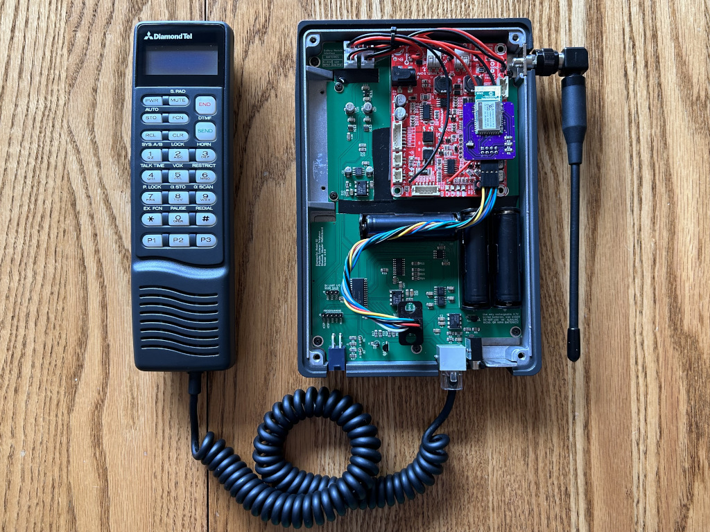
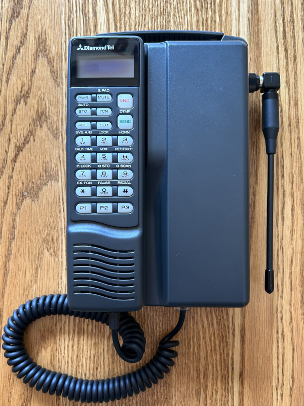
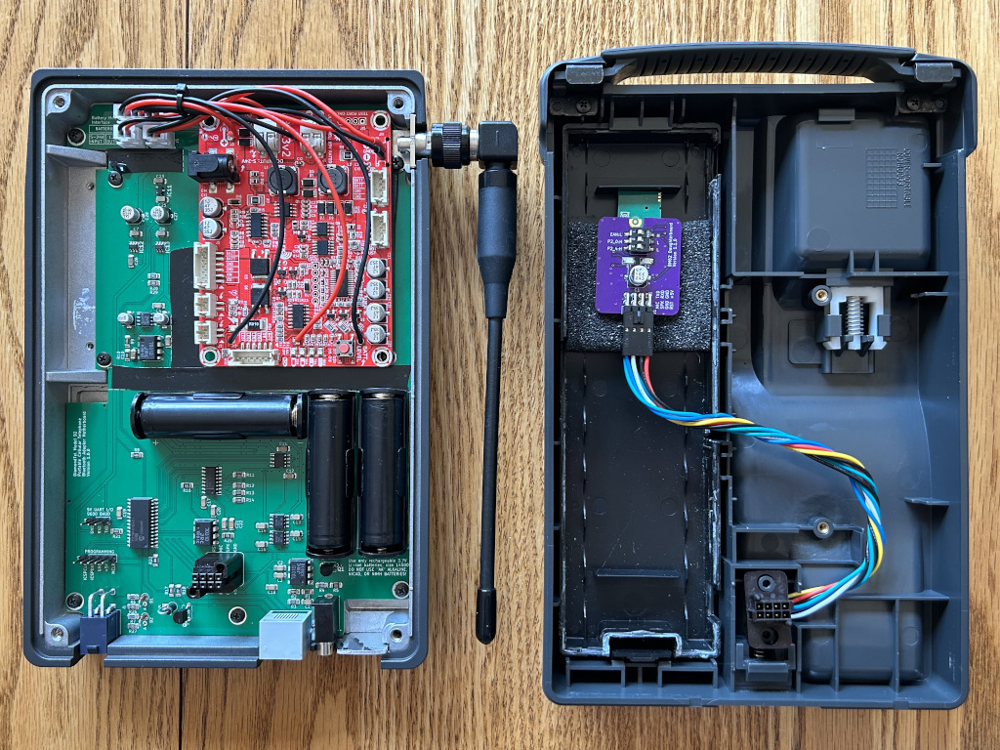
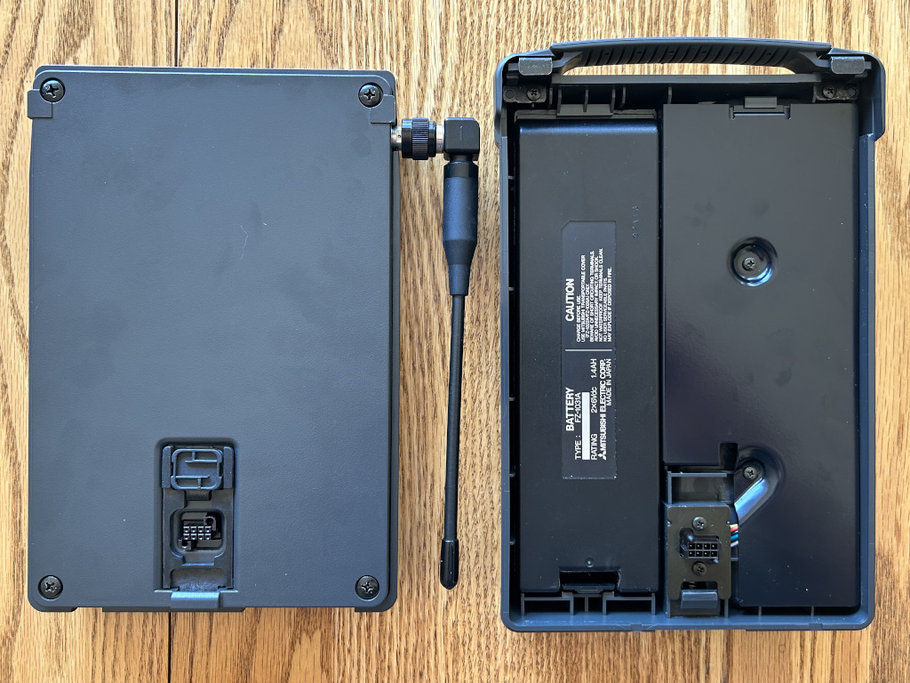
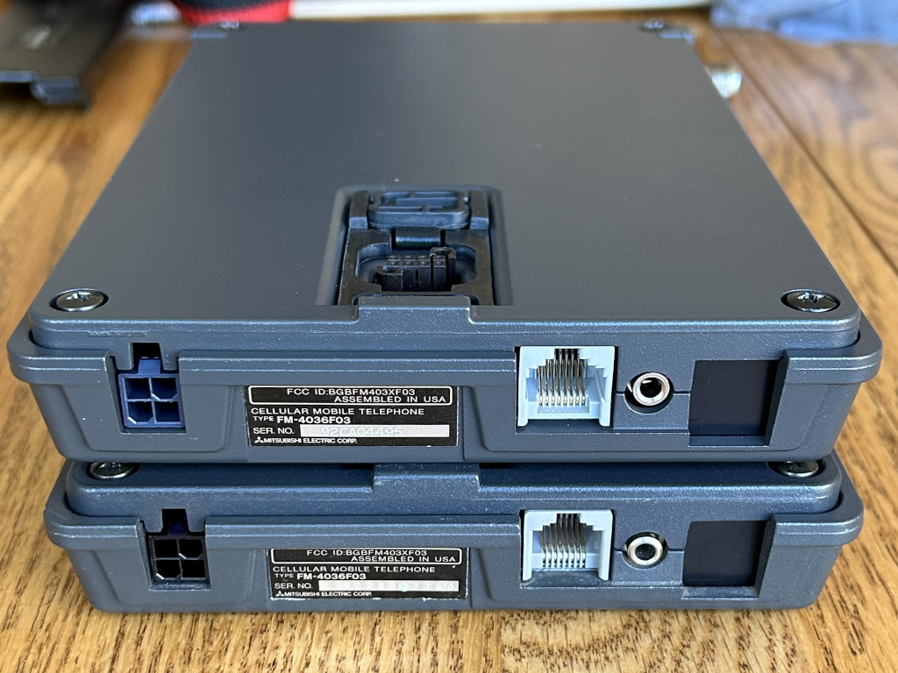

# DiamondTel Model 92 Bluetooth Adapter

This is an electronics/microcontroller project for adapting a DiamondTel Model 92 Portable Cellular Telephone to work as a fully functional phone by routing calls through a modern cell phone via the Bluetooth Hands-Free Profile (HFP).

|

This project includes both a custom electronics circuit and custom microcontroller software.

- [DiamondTel Model 92 Bluetooth Adapter](#diamondtel-model-92-bluetooth-adapter)
  - [About This Project](#about-this-project)
    - [TL;DR (with demo videos)](#tldr-with-demo-videos)
    - [The DiamondTel Model 92 Portable Cellular Telephone](#the-diamondtel-model-92-portable-cellular-telephone)
    - [Motivation / Goals](#motivation--goals)
    - [Project Forum Thread](#project-forum-thread)
    - [Discussion](#discussion)
    - [Documentation](#documentation)
    - [Media Coverage](#media-coverage)
  - [Basic Design](#basic-design)
    - [High Level Design Summary](#high-level-design-summary)
    - [Design Pros/Cons](#design-proscons)
  - [Compatibility](#compatibility)
    - [Vintage Mobile Phone](#vintage-mobile-phone)
    - [Paired Modern Cell Phone](#paired-modern-cell-phone)
  - [About the Author](#about-the-author)  
## About This Project

### TL;DR (with demo videos)

I have an old car phone in my early 90's car. It's impossible to activate service for these old phones. I made the old car phone actually work like a real phone.

Click to view a YouTube video tour and demo of the complete car phone system with Bluetooth adapter (NOTE: This video shows an older external plug-in version):

Click to view a YouTube video demo and disassembly of the new internal adapter design:

You can find all videos I have created about this project in [this YouTube playlist](https://www.youtube.com/playlist?list=PLOlio4FadqvQEWHDXaJHlkvHigROk-RNV).

### The DiamondTel Model 92 Portable Cellular Telephone

The DiamondTel Model 92 Portable Cellar Telephone is a hybrid transportable/mobile (mobile, as in, "car phone") manufactured by Mitsubishi in the early 1990's. 

The phone used 1G analog cellular technology ([AMPS](https://en.wikipedia.org/wiki/Advanced_Mobile_Phone_System)), which has been discontinued in the US since 2008. As such, it is impossible to activate service for this phone. 

See the contents and README in the `telephone` directory for more details.

### Motivation / Goals

I want my DiamondTel Model 92 telephone to actually work as a phone, and not just by hacking an off-the-shelf Bluetooth headset into the phone's handset. I want the complete experience of the phone to be nearly indistinguishable from how the phone was originally intended to behave:

- Incoming calls should cause the phone to ring, and I should be able to answer incoming calls as expected (press the "SEND" button or pick up the handset).
- I should be able to place outgoing calls by dialing a number on the handset then pressing "SEND".
- The handset display should work and display all relevant information just like the original phone did.
- Sounds should be accurate to the original phone (button press sounds, ringtone, status alert sounds, etc.).
- A majority of the phone's original features should be fully functional (e.g., volume controls, call timer, quick dial presets, contacts directory with names and numbers).

### Project Forum Thread

I have documented my entire journey with this project in an [Electro-Tech-Online.com forum thread](https://www.electro-tech-online.com/threads/making-a-bluetooth-adapter-for-a-car-phone-from-the-90s.162764/).

Browse this thread if you are interested in all the technical details of how I reverse-engineerd how the DiamondTel Model 92 telephone works, how I fumbled my way through the electronics/hardware (with much appreciated assistance), and various problems I had to solve.

Subscribe to this thread if you want to be notified of significant updates about this project.

### Discussion

Do you have something to ask/say about this project? You can reach out to me in [this Gitter chat room](https://gitter.im/UselessPickles/diamondtel-m92-bluetooth) or DM me on [Instagram (@uselesspickles)](https://www.instagram.com/uselesspickles/).

### Documentation

There's too much information to put in one README. Most directories of this project have a README containing relevant documentation for that portion of the project. So explore the directory structure and use the READMEs to get familiar with it.

### Media Coverage

There's been a bit of media coverage of my project. Here's some links:

- [Hackaday](https://hackaday.com/2023/04/13/custom-bluetooth-adapter-brings-1990s-car-phone-back-online/)
- [Jalopnik](https://jalopnik.com/vintage-factory-car-phone-connects-to-smartphone-1850329711)
- [CarBuzz](https://carbuzz.com/news/genius-turns-30-year-old-mitsubishi-3000gt-into-a-smartphone)
- Hagerty: Piston Slap
    - [Part 1](https://www.hagerty.com/media/advice/piston-slap/piston-slap-new-tricks-for-an-old-car-phone-part-iv/)
    - [Part 2](https://www.hagerty.com/media/advice/piston-slap/piston-slap-new-tricks-for-an-old-car-phone-part-v/)
- [Japanese Nastolgic Car](https://japanesenostalgiccar.com/mitsubishi-3000gt-car-phone-functional-with-iphone-bluetooth/)
- [Hackster.io](https://www.hackster.io/news/jeff-lau-s-open-source-bluetooth-adapter-brings-a-mitsubishi-carphone-classic-back-from-the-dead-383864868529)
- [The Drive](https://www.thedrive.com/news/clever-collector-mods-mitsubishi-3000gt-car-phone-to-work-like-an-iphone)

## Basic Design

### High Level Design Summary

This Bluetooth adapter is a complete replacement of the electronics inside the transceiver of the car phone. The handset of the car phone remains completely original and unmondified. The Bluetooth adapter pairs with a modern cell phone using the Hands-Free Profile (HFP), which enables the car phone handset to receive incoming calls and make outgoing calls through the paired modern cell phone.
    
The majority of the electronics is on the "motherboard" that installs in the metal transceiver case, and a smaller Bluetooth module "daugherboard" installs in the battery compartment of the plastic "transportable cover" so that the Bluetooth signal is not obstructed by the metal transceiver case.

The motherboard uses the same type of connectors as the original electronics for external power supply, handset cord, and external microphone. The connection between the mootherboard and the Bluetooth module daugherboard reuses the connectors that were originally used to connect the battery circuitry in the transportable cover to the transceiver. And finally, the Bluetooth module daughterboard can be hidden in the emptied shell of an original battery pack. The end result is that the modified car phone is practically visually indistinguishable from an original unmodified car phone, even when removing the transportable cover from the transceiver.

*Top: Modified transceiver; Bottom: Unmodified transceiver*

From a functionality perspective, the Bluetooth adapter faithfully replicates a large amount of the original car phone's functionality for a genuine retro experience that is often indistinguishable from the original phone. But since I do have full control of the handset, I did take the opportunity to add some new functionality (multiple ringtones, games, Caller ID, etc.). See the `operating_instructions` directory for more details.
    
### Design Pros/Cons

Pros:

- The vintage mobile phone has the appearance of being a completely original and functioning phone with no external adapters and no visible signs of modification.
- Can pair with practically any modern cell phone (no separate SIM card needed).
- I have full control of implementing any desired behavior (within limitations of the handset display/button capabilities, and within limitations of Bluetooth HFP), including functionality that was never available/possible on the original phone (e.g., Caller ID, games).

Cons:

- This is not a general design that will work with a wide range of vintage mobile phones.
- Requires a lot of custom software to replicate original DiamondTel Model 92 functionality as faithfully as possible (but that's OK with me; I'm a software engineer, and this is fun!).
- Installation is not simple, because it involves:
  - Desoldering and de-pinning some connectors from the original car pphone to transfer them to the Bluetooth adapter (these connectors are no longer available for purchase).
  - A small amount of grinding to remove some metal inside of the transceiver case.
  - Splitting open and disassembling an original battery pack if you want to hide the Bluetooth module daughterboard.

## Compatibility

### Vintage Mobile Phone

Because this design relies on a direct wired interface with the handset (using proprietary connections and digital communications), and the circuit board itself is specifically designed to fit in the transceiver case of a particular model of car phone, it has very limited compatibility. As of now, this project is only known to work with the following vintage mobile phones:

- DiamondTel Model 92
- Mitsubishi Model 1500

### Paired Modern Cell Phone

Any modern cell phone that supports Bluetooth Hands-Free Profile (HFP) _should_ (in theory) be able to pair with the Bluetooth adapter and work properly. I have a very limited selection of phones to test with, so I can't make any guarantees.

These are the modern cell phones that I have performed at least some basic testing with:

- Apple iPhone 8
- Apple iPhone SE
- Apple iPhone 14
- Google Pixel 3 XL

## About the Author

I'm a software engineer with primary professional expertise in front-end web app development, but I've also played around with some basic electronics and microcontoller programming for fun. This is by far my most ambitious electronics/microcontroller project. 

The electronics side of things is my weakness, and I've relied on quite a bit of assistance from people that know electronics better than me to get this far. If you know electronics, and think I did something stupid or unnecessary in my circuit design, then you're probably right! Please file an issue against this project if you have recommendations!
