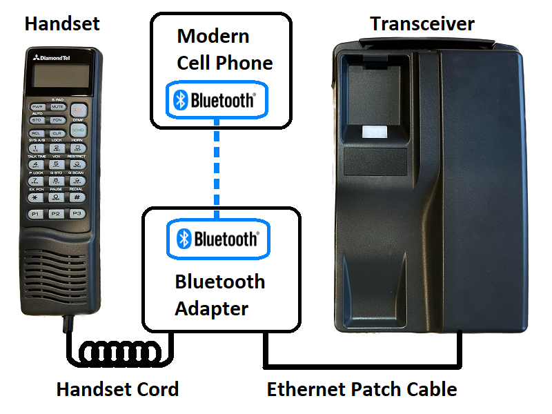

# DiamondTel Model 92 Bluetooth Adapter

This is an electronics/microcontroller project for adapting a DiamondTel Model 92 Portable Cellular Telephone to work as a fully functional phone by routing calls through a modern cell phone via the Bluetooth Hands-Free Profile (HFP).

This project includes both a custom electronics circuit and custom microcontroller software.

- [DiamondTel Model 92 Bluetooth Adapter](#diamondtel-model-92-bluetooth-adapter)
  - [Under Construction](#under-construction)
  - [About This Project](#about-this-project)
    - [TL;DR (with demo videos)](#tldr-with-demo-videos)
    - [The DiamondTel Model 92 Portable Cellular Telephone](#the-diamondtel-model-92-portable-cellular-telephone)
    - [Motivation / Goals](#motivation--goals)
    - [Project Forum Thread](#project-forum-thread)
    - [Discussion](#discussion)
    - [Documentation](#documentation)
  - [Basic Design](#basic-design)
    - [High Level Design Summary](#high-level-design-summary)
    - [Design Pros/Cons](#design-proscons)
  - [Compatibility](#compatibility)
    - [Vintage Mobile Phone](#vintage-mobile-phone)
    - [Paired Modern Cell Phone](#paired-modern-cell-phone)
  - [About the Author](#about-the-author)

## Under Construction

This repository is a work-in-progress. Check back often for more details and documentation.

## About This Project

### TL;DR (with demo videos)

I have an old car phone in my early 90's car. It's impossible to activate service for these old phones. I made the old car phone actually work like a real phone.

Click to view a YouTube video of the car phone making and receiving a call:

You can find all videos I have created about this project in [this YouTube playlist](https://www.youtube.com/playlist?list=PLOlio4FadqvQEWHDXaJHlkvHigROk-RNV).

### The DiamondTel Model 92 Portable Cellular Telephone

The DiamondTel Model 92 Portable Cellar Telephone is a hybrid transportable/mobile (mobile, as in, "car phone") manufactured by Mitsubishi in the early 1990's. 

The phone used 1G analog cellular technology ([AMPS](https://en.wikipedia.org/wiki/Advanced_Mobile_Phone_System)), which has been discontinued in the US since 2008. As such, it is impossible to activate service for this phone. 

See the contents and README in the `telephone` directory for more details.

### Motivation / Goals

I want my DiamondTel Model 92 telephone to actually work as a phone, and not just by hacking an off-the-shelf Bluetooth headset into the phone's handset. I want the complete experience of the phone to be nearly indistinguishable from how the phone was originally intended to behave:

- Incoming calls should cause the phone to ring, and I should be able to answer incoming calls as expected (press the "SEND" button or pick up the handset).
- I should be able to place outgoing calls by dialing a number on the handset then pressing "SEND".
- The handset display should work and display all relevant information just like the original phone did.
- Sounds should be accurate to the original phone (button press sounds, ringtone, status alert sounds, etc.).
- A majority of the phone's original features should be fully functional (e.g., volume controls, call timer, quick dial presets, contacts directory with names and numbers).

### Project Forum Thread

I have documented my entire journey with this project in an [Electro-Tech-Online.com forum thread](https://www.electro-tech-online.com/threads/making-a-bluetooth-adapter-for-a-car-phone-from-the-90s.162764/).

Browse this thread if you are interested in all the technical details of how I reverse-engineerd how the DiamondTel Model 92 telephone works, how I fumbled my way through the electronics/hardware (with much appreciated assistance), and various problems I had to solve.

Subscribe to this thread if you want to be notified of significant updates about this project.

### Discussion

Do you have something to ask/say about this project? You can reach out to me in [this Gitter chat room](https://gitter.im/UselessPickles/diamondtel-m92-bluetooth).

### Documentation

There's too much information to put in one README. Most directories of this project have a README containing relevant documentation for that portion of the project. So explore the directory structure and use the READMEs to get familiar with it.

## Basic Design

### High Level Design Summary

- A custom Bluetooth adapter connects inline between the DiamondTel Model 92 handset and transceiver.
- The transceiver provides its power supply and power on/off functionality to the Bluetooth adapter.
    - Power supply, ground, and handset power button connection is passed through the Bluetooth adapter between the handset and transceiver.
    - When the transceiver powers on, the Bluetooth adapter also powers on via the same power supply that powers the handset.
- The Bluetooth adapter takes full control of the handset.
- The Bluetooth adapter fully implements all behavior that is experienced by interacting with the handset. Much of it is a replica of (or inspired by) the DiamondTel Model 92's original behavior.
- The Bluetooth adapter communicates with the transceiver to monitor the transceiver battery level.    
- There is no direct pass-through communication between the handset and transceiver.
    - As far as the transceiver knows, it simply powers up and remains in its default idle state at all times (except for when the Bluetooth adapter requests the battery level).
- The Bluetooth adapter pairs with a modern cell phone using the Bluetooth Hands-Free Profile (HFP). This Bluetooth connection is used to:
    - Monitor/display cell service status and signal strength, etc.
    - Handle incoming calls.
    - Send outgoing calls.
    
### Design Pros/Cons

Pros:

- Plug-n-play design - no modifications to the original phone.
- No separate power supply is needed.
- Can pair with practically any modern cell phone (no separate SIM card needed).
- The vintage mobile phone has the appearance of being a completely original and functioning phone (assuming that the Bluetooth adapter is hidden, which is easy when the phone is installed in a vehicle as a car phone).
- Full control of implementing any desired behavior (within limitations of the handset display/button capabilities, and within limitations of Bluetooth HFP), including functionality that was never available/possible on the original phone (e.g., Caller ID).

Cons:

- Requires a lot of custom software to replicate original DiamondTel Model 92 functionality as faithfully as possible (but that's OK with me; I'm a software engineer, and this is fun!).
- This is not a general design that will work with a wide range of vintage mobile phones.

## Compatibility

### Vintage Mobile Phone

Because this design relies on a direct wired interface with the handset and transceiver (using proprietary connections and digital communications), it has very limited compatibility. As of now, this project is only known to work with the following vintage mobile phones:

- DiamondTel Model 92
- Mitsubishi Model 1500

### Paired Modern Cell Phone

Any modern cell phone that supports Bluetooth Hands-Free Profile (HFP) _should_ (in theory) be able to pair with the Bluetooth adapter and work properly. I have a very limited selection of phones to test with, so I can't make any guarantees.

These are the modern cell phones performed at least some basic testing with:

- Apple iPhone 8
- Apple iPhone SE
- Apple iPhone 14
- Google Pixel 3 XL

## About the Author

I'm a software engineer with primary professional expertise in front-end web app development, but I've also played around with some basic electronics and microcontoller programming for fun. This is by far my most ambitious electronics/microcontroller project. 

The electronics side of things is my weakness, and I've relied on quite a bit of assistance from people that know electronics better than me to get this far. If you know electronics, and think I did something stupid or unnecessary in my circuit design, then you're probably right! Please file an issue against this project if you have recommendations!
