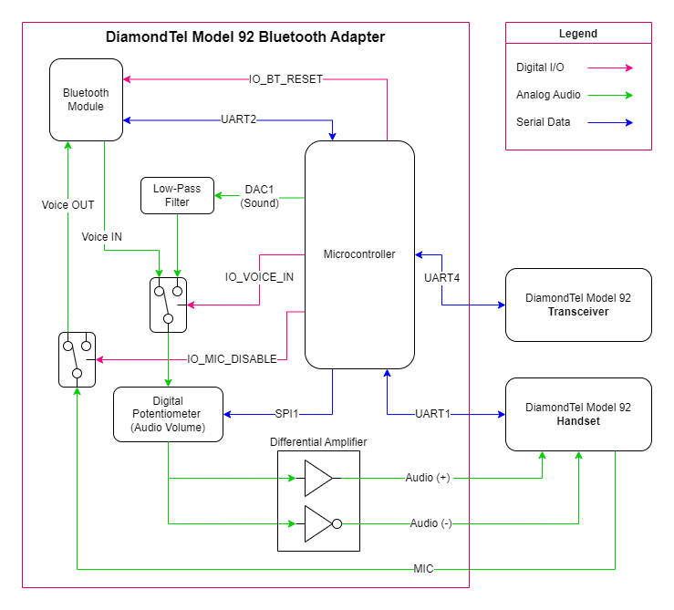

# Bluetooth Adapter Hardware

This directory contains information about the hardware portion of the DiamondTel Model 92 Bluetooth adapter.

NOTE: The Bluetooth Module, Microcontroller, and Telephone all have dedicated top-level directories with relevant technical information, datasheets, and much more. This directory focuses more on combining all the components together into the bluetooth adapter hardware.

- [Bluetooth Adapter Hardware](#bluetooth-adapter-hardware)
  - [Basic Circuit Design](#basic-circuit-design)
  - [Major Circuit Components](#major-circuit-components)
    - [Microcontroller (PIC18F27Q43)](#microcontroller-pic18f27q43)
    - [Bluetooth Module (BM62)](#bluetooth-module-bm62)
    - [Analog Switches (MAX4619)](#analog-switches-max4619)
    - [Op Amp Buffer (NJU7031)](#op-amp-buffer-nju7031)
    - [Low-Pass Filter](#low-pass-filter)
    - [Digital Potentiometer (MCP4151)](#digital-potentiometer-mcp4151)
    - [Differential Amplifier (INA105)](#differential-amplifier-ina105)
    - [5V Voltage Regulator (L7805CV)](#5v-voltage-regulator-l7805cv)
    - [Negative Voltage Converter (TL7660)](#negative-voltage-converter-tl7660)
  - [Detailed Circuit Diagrams](#detailed-circuit-diagrams)
  
## Basic Circuit Design

This is a simplified component diagram of the bluetooth adapter circuit. Many details of the circuit (power, ground, voltage biasing, supporting components, etc.) are omitted for clarity of understanding the big picture of how the major components interact with each other.

## Major Circuit Components

This is a summary of all the major components of the bluetooth adapter circuit.

NOTE: Not all of these components are represented in the [Basic Circuit Design](#basic-circuit-design) diagram.

### Microcontroller (PIC18F27Q43)

This is what integrates everything together and implements all the interactive phone behavior.

See the top-level `/microcontroller` directory and the contained MPLAB project directory for more details.

### Bluetooth Module (BM62)

This handles all the Bluetooth communication with a modern cell phone, as commanded by the Microcontroller.

See the top-level `/bluetooth` directory for more details.

### Analog Switches (MAX4619)

This component is a set of 3 analog SPDT switches in one component. This is used to allow the Microcontroller to control the routing of audio:

- Choose between sending incoming voice audio or Microcontroller-generated sounds to the Handset.
- Disable the microphone connection between the Handset and the Bluetooth Module.

See the datasheet in the `datasheets` directory.

### Op Amp Buffer (NJU7031)

This Op Amp is used to buffer the raw DAC sound output from the Microcontroller before passing it through any further circuitry.

### Low-Pass Filter

A 2-stage RC network is used to smooth out the 10KHz sample rate DAC audio output from the Microcontroller.

### Digital Potentiometer (MCP4151)

This digital potentiometer allows the Microcontroller to control the volume of audio output the the Handset.

See the datasheet in the `datasheets` directory.

### Differential Amplifier (INA105)

A pair of precision amplifiers is used to produce the [differential](https://en.wikipedia.org/wiki/Differential_signalling) audio output to the Handset. One amplifier is configured as an inverting unity gain amplifier, and the other is configured as an non-inverting unity gain buffer.

NOTE: This component requires a +5V and -5V power supply.

See the datasheet in the `datasheets` directory.

### 5V Voltage Regulator (L7805CV)

This voltage regulator produces a +5V power supply for the circuit. The ~12V power supply from the Transceiver is used as input.

See the datasheet in the `datasheets` directory.

### Negative Voltage Converter (TL7660)

This component produces a -5V power supply from the main +5V power supply. This is necessary for the [Differential Amplifier](#differential-amplifier-ina105).

## Detailed Circuit Diagrams

Coming Soon?