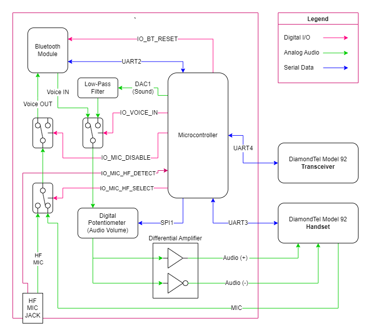

# Bluetooth Adapter Hardware

This directory contains information about the hardware portion of the DiamondTel Model 92 Bluetooth adapter.

NOTE: The Bluetooth Module, Microcontroller, and Telephone all have dedicated top-level directories with relevant technical information, datasheets, and much more. This directory focuses more on combining all the components together into the bluetooth adapter hardware.

- [Bluetooth Adapter Hardware](#bluetooth-adapter-hardware)
  - [Basic Circuit Design](#basic-circuit-design)
  - [Major Circuit Components](#major-circuit-components)
    - [Microcontroller (PIC18F27Q43)](#microcontroller-pic18f27q43)
    - [Bluetooth Module (BM62)](#bluetooth-module-bm62)
    - [Hands-Free Microphone Jack (STX3120)](#hands-free-microphone-jack-stx3120)
    - [Analog Switches (MAX4619)](#analog-switches-max4619)
    - [Op Amp (NJU7031)](#op-amp-nju7031)
    - [Low-Pass Filter](#low-pass-filter)
    - [Digital Potentiometer (MCP4151)](#digital-potentiometer-mcp4151)
    - [Differential Audio Driver (DRV134)](#differential-audio-driver-drv134)
    - [5V Voltage Regulator (L7805CV)](#5v-voltage-regulator-l7805cv)
    - [Negative Voltage Converter (TL7660)](#negative-voltage-converter-tl7660)
  - [Detailed Circuit Diagrams](#detailed-circuit-diagrams)
  - [Prototype Board Layout](#prototype-board-layout)
  
## Basic Circuit Design

This is a simplified component diagram of the bluetooth adapter circuit. Many details of the circuit (power, ground, voltage biasing, supporting components, etc.) are omitted for clarity of understanding the big picture of how the major components interact with each other.

## Major Circuit Components

This is a summary of all the major components of the bluetooth adapter circuit.

Datasheets for most components can be found in `datasheets` directory.

NOTE: Not all of these components are represented in the [Basic Circuit Design](#basic-circuit-design) diagram.

### Microcontroller (PIC18F27Q43)

This is what integrates everything together and implements all the interactive phone behavior.

See the top-level `/microcontroller` directory and the contained MPLAB project directory for more details.

### Bluetooth Module (BM62)

This handles all the Bluetooth communication with a modern cell phone, as commanded by the Microcontroller.

See the top-level `/bluetooth` directory for more details.

### Hands-Free Microphone Jack (STX3120)

This 3.5mm audio jack is used for connecting an external microphone for hands-free conversation.

The jack includes disconnect switches that are used to trigger a digital input to the MCU, indicating when
an external microphone is connected.

### Analog Switches (MAX4619)

This component is a set of 3 analog SPDT switches in one component. This is used to allow the Microcontroller to control the routing of audio:

- Choose between sending incoming voice audio or MCU-generated sounds to the Handset.
- Choose between sending the handset microphone audio or external hands-free microphone audio to the Bluetooth Module.
- Disable the microphone connection to the Bluetooth Module to temporarily "mute" the microphone while the MCU is generating sound output to the Handset.

### Op Amp (NJU7031)

This Op Amp is used to buffer the raw DAC sound output from the Microcontroller before passing it through any further circuitry.

Another is used to amplify the incoming audio from the external hands-free microphone jack.

### Low-Pass Filter

A 2-stage RC network is used to smooth out the 10KHz sample rate DAC audio output from the Microcontroller.

### Digital Potentiometer (MCP4151)

This digital potentiometer allows the Microcontroller to control the volume of audio output the the Handset.

### Differential Audio Driver (DRV134)

A differential audio driver is used to produce [differential](https://en.wikipedia.org/wiki/Differential_signalling) audio output to the Handset.

NOTE: This component requires a +5V and -5V power supply.

### 5V Voltage Regulator (L7805CV)

This voltage regulator produces a +5V power supply for the circuit. The ~12V power supply from the Transceiver is used as input.

### Negative Voltage Converter (TL7660)

This component produces a -5V power supply from the main +5V power supply. This is necessary for the [Differential Audio Driver](#differential-audio-driver-drv134).

## Detailed Circuit Diagrams

Coming Soon?

## Prototype Board Layout

This is a layout of the circuit for a pad-per-hole perf board, designed with [VeroRoute](https://sourceforge.net/projects/veroroute/) software. See the `./VeroRoute` directory for the VeroRoute layout file.

Notes:
- The perf board is a [15x20 cm prototype board I found on Amazon](https://www.amazon.com/gp/product/B08WJDP144), trimmed down to size to fit in a [Radioshack 5x7x3 project enclosure box](https://www.radioshack.com/products/project-enclosure-7x5x3).
- I use this [BM62 Breadboard Adapter](https://www.tindie.com/products/tomaskovacik/bm20bm62-breadboard-adapter/) and a pair of female socket strips to both easily adapt the Bluetooth chip to the 0.1" hole spacing, and allow the Bluetooth chip to be removed from the prototype board for configuration updates on a breadboard.
- I use RJ45 socket breakout boards that I found on [ebay from a company called MDFLY](https://www.ebay.com/itm/304544572432). In retrospect, I think another form of breakout board with all pins arranged in a single row may have been more convenient for routing traces. But maybe I'll come up with a good reason to use the LEDs on these sockets.
