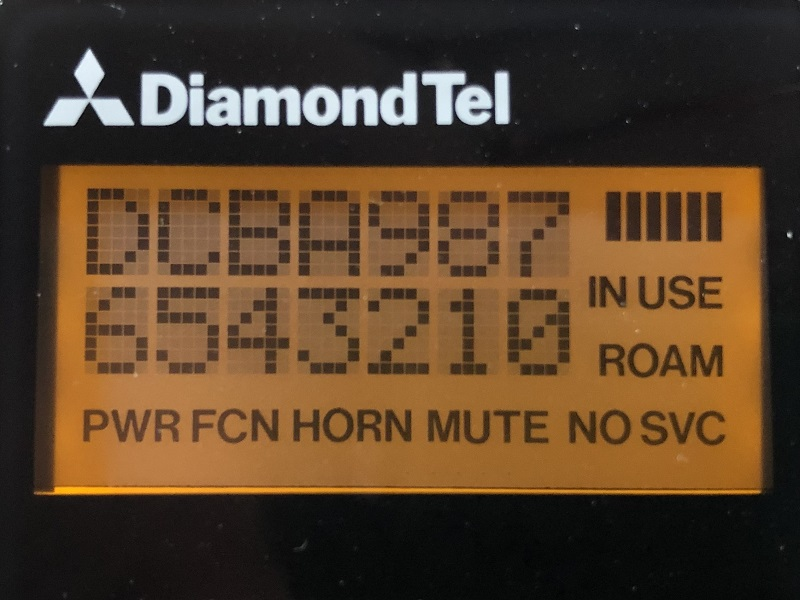
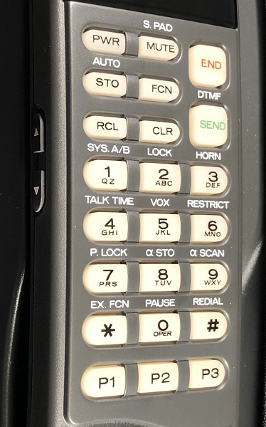
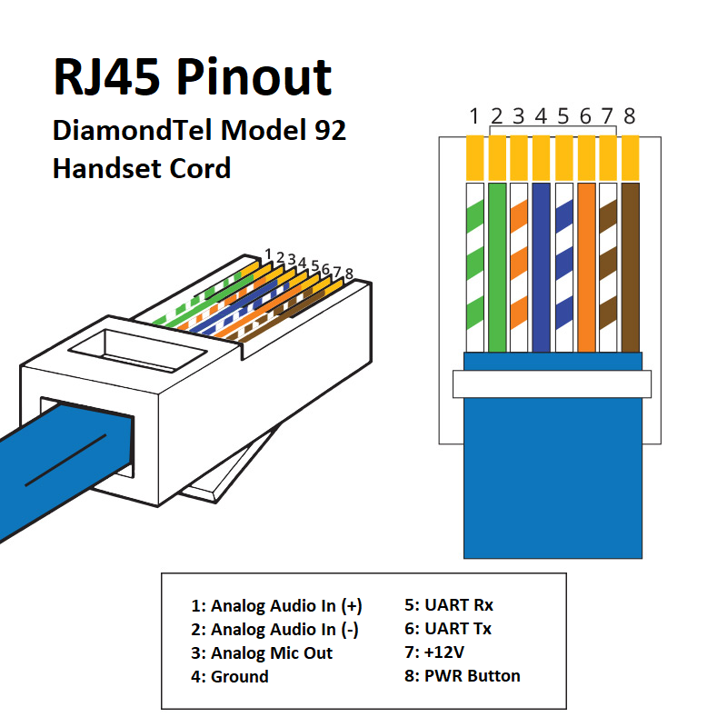
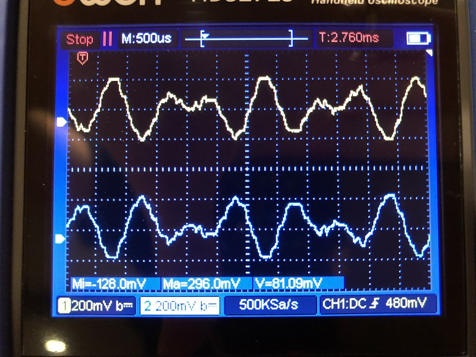
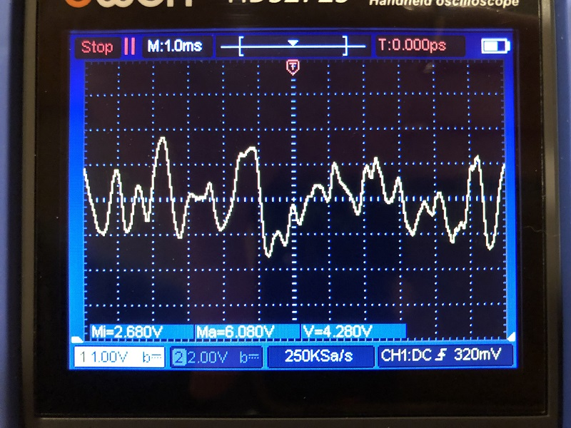
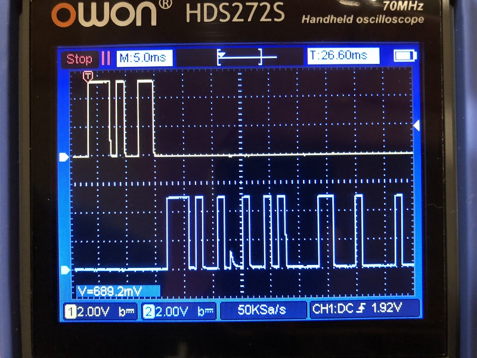

# DiamondTel Model 92 Cellular Telephone

This directory and README contains information about the DiamondTel Model 92 Cellular Telephone that this project is designed to work with.

- [DiamondTel Model 92 Cellular Telephone](#diamondtel-model-92-cellular-telephone)
  - [About the Phone](#about-the-phone)
  - [Handset Features](#handset-features)
    - [General](#general)
    - [Display](#display)
    - [Buttons](#buttons)
    - [Backlight](#backlight)
    - [Audio](#audio)
  - [Handset Cord RJ45 Pinout](#handset-cord-rj45-pinout)
    - [Power and Ground (Pins 7 and 4)](#power-and-ground-pins-7-and-4)
    - [PWR Button (Pin 8)](#pwr-button-pin-8)
    - [Analog Audio Input (Pins 1 and 2)](#analog-audio-input-pins-1-and-2)
    - [Analog Microphone Output (Pin 3)](#analog-microphone-output-pin-3)
    - [Digital Data UART Rx/Tx (Pins 5 and 6)](#digital-data-uart-rxtx-pins-5-and-6)
  - [Handset UART Events](#handset-uart-events)
    - [Basic Button Presses](#basic-button-presses)
    - [Button Release](#button-release)
    - [CLR Button Modifier](#clr-button-modifier)
    - [Overlapping Button Presses](#overlapping-button-presses)
    - [Hook Status](#hook-status)
  - [Handset UART Commands](#handset-uart-commands)
    - [Delete Text](#delete-text)
    - [Print Text](#print-text)
    - [Text Display On/Off](#text-display-onoff)
    - [Blinking Text](#blinking-text)
    - [All Text Pixels On/Off](#all-text-pixels-onoff)
    - [Flashing Cursor](#flashing-cursor)
    - [LCD Display Angle](#lcd-display-angle)
    - [Backlight On/Off](#backlight-onoff)
    - [Indicators On/Off](#indicators-onoff)
    - [Set Signal Strength](#set-signal-strength)
    - [Audio On/Off](#audio-onoff)
    - [Request Hook Status](#request-hook-status)
    - [Mysterious UART Command and Event Response](#mysterious-uart-command-and-event-response)
  - [Handset Sound Frequencies](#handset-sound-frequencies)
  
## About the Phone

The DiamondTel Model 92 Portable Cellar Telephone is a hybrid transportable/mobile (mobile, as in, "car phone") manufactured by Mitsubishi in the early 1990's. 

The phone used 1G analog cellular technology ([AMPS](https://en.wikipedia.org/wiki/Advanced_Mobile_Phone_System)), which has been discontinued in US since 2008. As such, it is impossible to activate service for this phone. 

This phone is of particular interest to me because it was available as an [official accessory from Mitsubishi for my 1993 Mitsubishi 3000GT VR4](https://www.3swiki.org/Accessory:_Cellular_Telephone). 

## Handset Features

### General

The handset is purely an I/O device, like a combined monitor, keyboard, microphone, and speakers. It only knows how to display whatever it is commanded to display, play watever sounds are provided to it, and it sends messages back to indicate when buttons are pressed/released. Whatever device the handset is plugged into (the original tranceiver, or the custom Bluetooth adapter) is responsible for actually implementing all desired behavior.

### Display

The handset has a backlit LCD display that can display 14 characters of arbitrary text and several pre-defined status indicators.

#### Indicators

Most indicators are simply turned on/of via single UART commands. Special cases are:

- `NO SVC`: This is actually two separate indicators, `NO` and `SVC`, although they are alays turned on/off togetehr in practice.
- Signal Strength: Each of the 6 singal strenght bars is an individual indicator that can be turned on/off, but there are also special UART commands for setting them to represent a numeric signal strength in the range 0-6.

See the UART command reference for more details.

#### Text

The text portion of the display can display most standard ASCII characters, and a handful of special symbol characters that do not align with standard or extended ASCII.

There is no known way to control individual pixels, or define custom characters.

Each character position on the display can be mapped to a position index, starting with 0 at the bottom right to 6 at the bottm left, then wrapping around to 7 at the top right and continuing to 13 at the top left (the image of the display above shows this with hexadecimal index characters displayed in corresponding positions).

This order of the position indexes is also the natural flow of characters as they are "pushed" onto the display.

See the UART command reference for more details.

#### Adjustable View Angle

The contrast between the "on" and "off" pixels within the text area is only ideal from a narrow viewing angle. Through some black magic I don't understand, the handset supports adjusting this ideal viewing angle (via UART commands, of course).

See the UART command reference for more details.

### Buttons

In addition to the obvious buttons on the face of the handset, there are also 2 buttons on the side of the handset for up/down input (used for volume adjustment, scrolling through contacts, etc.). 

The [power button (PWR)](#pwr-button-pin-8) is unique in that it is the only directly-wired hardware button. All other buttons cause UART events when pressed/released.

### Backlight

Both the LCD display and the buttons on the front face of the handset have backlighting.

The backlight can be turned on/off via UART commands.

See the UART command reference for more details.

### Audio

The handset has a microphone, an ear speaker, and a loud speaker.

The ear speaker and microphone are used for hand-held conversation (holding the handset up to your head). 

The loud speaker is used for hands-free conversation, as well as general sound effects (button beeps, status alerts, etc).

The phone does not have a built-in microphone for hands-free mode. Instead, the transceiver has a microphone jack for use with an external microphone.

See the RJ45 pinout sections about the [audio input](#analog-audio-input-pins-1-and-2) and [microphone output](#analog-microphone-output-pin-3) for more technical details.

## Handset Cord RJ45 Pinout

The handset cord contains 8 wires and ends with a standard RJ45 plug (same type of connector that network/ethernet cables use).

NOTE: All voltage observations mentioned in this section were taken while the handset was connected to the original telephone transceiver.

### Power and Ground (Pins 7 and 4)

Ground reference is provided on pin 4.

The handset turns on when about +12V is supplied to pin 7. The exact voltage varies quite a bit based on the transceiver's power supply and battery level (when battery-powered). I've casually noticed voltages in the 10-14V range.

### PWR Button (Pin 8)

Pin 8 is connected to the PWR (power) button on the handset. The button is a normally-open momentary button that connects to ground with a small resistance (~40 Ohms) when pressed. The transceiver seems to use a pull-up resister to about +12V while the phone is OFF. Voltage on this pin is just over 2V while the phone is ON (unknown why/how).

### Analog Audio Input (Pins 1 and 2)

All audio output to the handset comes in through pins 1 and 2 as analog mono-channel [differential](https://en.wikipedia.org/wiki/Differential_signalling) audio. The same audio signal is provided on both pins, but the signal on one pin is reverse polarity (negated) relative to the other pin.

The signal seems to be biased to 0V, and max peak-to-peak voltage is about 0.5V on each pin for button press sounds at the highest volume level.

NOTE 1: The audio is not played by the handset unless a speaker has been enabled by UART commands. UART commands control whether sound goes to the ear speaker or the loud speaker.

NOTE 2: The handset does not have any direct volume control. The audio source is responsible for attenuating the audio signal based on the current desired volume level.

### Analog Microphone Output (Pin 3)

The handset outputs mono-channel microphone audio on pin 3, but only when the microphone is enabled via UART commands.

The signal seems to be biased to about 4.3V with max peak-to-peak voltage of about 5.5V.

When the microphone is disabled, voltage on this pin is about 1.7V.

### Digital Data UART Rx/Tx (Pins 5 and 6)

The handset receives digital serial [UART](https://en.wikipedia.org/wiki/Universal_asynchronous_receiver-transmitter) messages (commands) on pin 5, and transmits digital serial UART messages (events) on pin 6.

The UART operates at 800 baud, and is inverted from standard UART (idles low, start bit is high, data bits are high=0/low=1, and stop bit is low). There are 8 data bits per message, and no parity bit.

NOTE: The operating voltage of the UART seems to fluctuate with the transceiver power supply or battery level, and can be higher than 5V.

## Handset UART Events

All UART events from the handset are simple 1-byte messages.

Also see the `DiamondTel Model 92 Handset UART Events and Commands` spreadsheet in this directory for a complete ordered list of events.

### Basic Button Presses

Aside from the [power button (PWR)](#pwr-button-pin-8), each button sends an event when pressed:

| Button | Event   |
|--------|---------|
| #      | 0x23    |
| *      | 0x2A    |
| 0      | 0x30    |
| 1      | 0x31    |
| 2      | 0x32    |
| 3      | 0x33    |
| 4      | 0x34    |
| 5      | 0x35    |
| 6      | 0x36    |
| 7      | 0x37    |
| 8      | 0x38    |
| 9      | 0x39    |
| [up]   | 0x58    |
| [down] | 0x59    |
| CLR    | 0x80    |
| FCN    | 0x81    |
| P1     | 0x82    |
| P2     | 0x83    |
| P3     | 0x84    |
| STO    | 0x85    |
| RCL    | 0x86    |
| MUTE   | 0x87    |
| END    | 0x88    |
| SEND   | 0x89    |

NOTE: The UART event codes for all of the "printable" buttons (#, *, and all numbers) are also the ASCII code for the same character on the buttons.

### Button Release

There is only a single UART event code sent when any button is released. There is no way to deduce from the event code itself which button was released.

| Action  | Event |
|---------|-------|
| Release | 0x04  |

NOTE: The event code for button release is also the ASCII `EOT` code.

### CLR Button Modifier

If the `CLR` button is held down while pressing another button, then the handset sends a distinct event code to indicate that the button was pressed with the `CLR` button also held down:

| Button       | Event   |
|--------------|---------|
| CLR + 0      | 0x90    |
| CLR + 1      | 0x91    |
| CLR + 2      | 0x92    |
| CLR + 3      | 0x93    |
| CLR + 4      | 0x94    |
| CLR + 5      | 0x95    |
| CLR + 6      | 0x96    |
| CLR + 7      | 0x97    |
| CLR + 8      | 0x98    |
| CLR + 9      | 0x99    |
| CLR + #      | 0x9A    |
| CLR + *      | 0x9B    |
| CLR + P1     | 0x9C    |
| CLR + P2     | 0x9D    |
| CLR + P3     | 0x9E    |
| CLR + STO    | 0x9F    |
| CLR + RCL    | 0xA0    |
| CLR + MUTE   | 0xA1    |
| CLR + END    | 0xA2    |
| CLR + SEND   | 0xA3    |
| CLR + [up]   | 0xA4    |
| CLR + [down] | 0xA5    |

There are two notable exceptions:
- `CLR` - Because you obviously can't press `CLR` while `CLR` is already held.
- `FCN` - The `FCN` always sends the plain event for `FCN` regardless of whether the `CLR` button is held.

The purpose for these special event codes in the original phone behavior was to support special `CLR`-codes to enter special diagnostic and programming modes. Entering these modes requires that you power on the phone, then within 10 seconds, press and hold `CLR` while typing a sequence of numbers.

NOTE: Only this special event code is sent when a button is pressed while the `CLR` button is held. The regular event code for the button press is not sent in this situation.

### Overlapping Button Presses

There's some very interesting behavior when multiple button presses overlap each other. Combined with the limitation of only a single "button release" event code, this can unfortunately make it impossible to accurately keep track of which buttons are truly pressed at any given time.

For all buttons except `FCN` and `CLR`, the handset cannot keep track of more than one button at a time. Some examples of button press sequences and resulting events are the best way to explain this.

| # | Action    | Event |
|---|-----------|-------|
| 1 | Press 1   | 0x31: Press 1 |
| 2 | Press 2   | 0x04: Release |
| 3 | Release 1 | 0x32: Press 2 |
| 4 | Release 2 | 0x04: Release |

| # | Action    | Event |
|---|-----------|-------|
| 1 | Press 1   | 0x31: Press 1 |
| 2 | Press 2   | 0x04: Release |
| 3 | Release 2 | 0x31: Press 1 |
| 4 | Release 1 | 0x04: Release |

When `FCN` or `CLR` are involved, then the sequence of events makes more sense, but there's still ambiguity in the release events:

| # | Action      | Event |
|---|-------------|-------|
| 1 | Press FCN   | 0x81: Press FCN |
| 2 | Press 1     | 0x31: Press 1 |
| 3 | Release 1   | 0x04: Release |
| 4 | Release FCN | 0x04: Release |

| # | Action      | Event |
|---|-------------|-------|
| 1 | Press CLR   | 0x80: Press CLR |
| 2 | Press 1     | 0x91: Press CLR + 1 |
| 3 | Release 1   | 0x04: Release |
| 4 | Release FCN | 0x04: Release |

As a result of these confusing event sequences, it's best to avoid any UX design that relies on multiple overlapping button presses, except for handling the special `CLR`-modified button presses.

### Hook Status

Whenever the handset is picked up ("off hook") or hung back up ("on hook"), it sends an event to report the change in hook status.

| Hook Status | Event |
|-------------|-------|
| On Hook     | 0x8A  |
| Off Hook    | 0x8B  |

NOTE: There is also a UART command to [request the hook status](#request-hook-status) at any time.

## Handset UART Commands

All UART commands are simple 1-byte messages, except for the 2-byte message sequence used for [Positioned Printing](#positioned-printing).

Also see the `DiamondTel Model 92 Handset UART Events and Commands` spreadsheet in this directory for a complete ordered list of commands.

### Delete Text

The single command deletes all text from the display.

| Action          | Command |
|-----------------|---------|
| Delete All Text | 0x7F |

NOTE: this command code is the same as the ASCII delete character.

### Print Text

There are two ways to print text to the display:
1. "Standard" printing.
1. "Positioned" printing.

#### Standard Printing

"Standard" printing is as simple as sending the UART command code that corresponds to the character you want to print to the display. The character will be printed to position 0 of the text display, and all prevously printed characters will be pushed up to the next higher position (See the [Text Display](#text) section for display positioning info).

| Command     | Printed Character Description |
|-------------|-------------|
| 0x20 - 0x7E | Standard ASCII characters (with a few exceptions below) |
| 0x5C        | `¥` (yen symbol; deviates from standard ASCII for `\`) |
| 0x60        | `α` (greek alpha; deviates from standard ASCII for backtick) |
| 0x7E        | `→` (right arrow; deviates from standard ASCII for `~`) |
| 0xC0        | Small up arrow (outline) |
| 0xC1        | Small down arrow (outline) |
| 0xC2        | Small up arrow (solid) |
| 0xC3        | Small down arrow (solid) |
| 0xC4        | Large up arrow (solid) |
| 0xC5        | Large down arrow (solid) |
| 0xC6        | Solid rectangle (all pixles of the character) |
| 0xC7        | Horizontally striped rectangle, or upside-down "T" symbole, depending on age of handset |

#### Positioned Printing

A character can be printed to a specific display position using the positioning commands (See the [Text Display](#text) section for display positioning info).

| Action          | Command |
|-----------------|---------|
| Set next print position | 0x01 - 0x0E |

The command for a desired display position is calculated as `0x01 + [display position index]`, where `[display position index]` is in the range `0 - 13`.

After sending the positioning command, send a [standard character printing command](#standard-printing), and the specified character will be printed to the desired position.

NOTE: The positioning command only affects the immediately next character printing command. A subsequent character printing command would print via [Standard Printing](#standard-printing).

#### Interaction between Standard and Positioned Printing

If a position print places a character in a position currently occupied by a standard printed character, then the positioned character overwrites that the character at that position, but retains the behavior of standard printing. It will be pushed to the next higher position next time standard printing pushes a character onto the display.

However, if a position print places a character in a position that has NOT yet been reached by standard printing, then the positioned character will remain in its initial position until standard printing "overtakes" and overwrites it.

### Text Display On/Off

The text portion of the display can be turned on/off.

While the text display is OFF, no text is displayed, but the handset still maintains state of what is currently printed.

| Action           | Command |
|------------------|---------|
| Text Display ON  | 0xB6 |
| Text Display OFF | 0xB7 |

The normal use case for this feature is to disable the text display before printing multiple characters, then re-enable the text display after all characters are printed. The UART baud rate is so slow that the progress of printing an entire string of characters is visible to the user if the display is not disabled while printing.

### Blinking Text

The handset supports a blinking text mode, where the entire text display flashes on/off at about 1 flash per second.

| Action      | Command |
|-------------|---------|
| Blinking ON | 0xB8 |
| Blink OFF   | 0xB9 |

NOTE: This blinking effect is acheived by automatically enabling/disabling the text display. Any attempt to manually [enable/disable the text display](#text-display-onoff) will quickly be overridden by the blinking, until the blinking is disabled.

### All Text Pixels On/Off

There are commands for turning all text display pixels on/off.

| Action         | Command |
|----------------|---------|
| All Pixels ON  | 0xBA |
| All Pixels OFF | 0xBB |

The interaction between this and the current state of characters printed to the display is unknown. It is recommended to use the [delete command](#delete-text) to clear the text display instead.

### Flashing Cursor

A flashing cursor can be placed at any text display position (See the [Text Display](#text) section for display positioning info). The cursor alternates between a solid rectangle and whatever character is currently printed to the same position.

| Action         | Command |
|----------------|---------|
| Display Cursor | 0xD0 - 0xDD |
| Hide Cursor    | 0xDE |

The command for displaying the cursor at a desired position is calculated as `0xD0 + [display position index]`, where `[display position index]` is in the range `0 - 13`.

The cursor can only be displayed while the text display is enabled. The cursor will be automatically hidden if the [text display is disabled](#text-display-onoff), or if [text is deleted](#delete-text).

There are unfortunately some strange bugs with the flashing cursor:
1. After the  flashing cursor position is set higher than 6, positioning seems to become corrupted until a character is printed to the display.
1. Cursor cannot be displayed at positions 0-6 unless at least one character has been already printed to the display.
1. Hiding the cursor doesn't always seem to work.

Through trial and error, the following sequence has been found to reliably position and reposition the cursor anywhere on the display:
1. Print any character anywhere on the display.
1. Send the `Hide Cursor` command (`0xDE`).
1. Send the desired `Show Cursor` command (`0xD0 - 0xDD`).

Conveniently, the `Hide Cursor` command always seems to work after using the above sequence to display the cursor.

NOTE: It's fairly easy to keep track of what character is currently printed at display position `0` at all times (defaulting to a blank space if nothing is printed). This character can then be printed at position 0 to achieve the first step of the above sequence without altering the current text on the display.

### LCD Display Angle

The [adjustable view angle](#adjustable-view-angle) of the LCD text display can be set to one of 8 settings.

| Action            | Command |
|-------------------|---------|
| Set Viewing Angle | 0xC8 - 0xCF |

The command for setting the desired view angle is calculated as `0xC8 + [view angle]`, where `[view angle]` is in the range `0 - 7`.

NOTE: The view angles presented on screen to the user by the original phone are in reverse order, and one-based. That is, `[displayed angle] = 8 - [view angle]` and `[view angle] = 8 - [displayed angle]`, where `[displayed angle]` is in the range `1 - 8`.

### Backlight On/Off

The handset's [backlight](#backlight) can be turned on/off.

| Action        | Command |
|---------------|---------|
| Backlight ON  | 0xAC |
| Backlight OFF | 0xAD |

### Indicators On/Off

Every [status indicator](#indicators) on the display can be toggled on/off with a pair of commands per indicator. There is also a pair of commands that turns ALL indicators on/off.

| Indicator      | ON Command | OFF Command |
|----------------|------------|-------------|
| PWR            | 0x82 | 0x83 |
| FCN            | 0x84 | 0x85 |
| HORN           | 0x86 | 0x87 |
| MUTE           | 0x88 | 0x89 |
| IN USE         | 0x9C | 0x9D |
| ROAM           | 0x80 | 0x81 |
| NO             | 0x8A | 0x8B |
| SVC            | 0x8E | 0x8F |
| Signal Bar #1  | 0x90 | 0x91 |
| Signal Bar #2  | 0x92 | 0x93 |
| Signal Bar #3  | 0x94 | 0x95 |
| Signal Bar #4  | 0x96 | 0x97 |
| Signal Bar #5  | 0x98 | 0x99 |
| Signal Bar #6  | 0x9A | 0x9B |
| All Indicators | 0xBC | 0xBD |

NOTE: There's a common pattern of `[off command] = [on command] + 1` for each pair of on/off commands.

### Set Signal Strength

The signal strength [indicator](#indicators) bars can be updated conveniently with a single command to turn each individual signal bar on/off as needed to represent a specified numeric signal strength.

| Action              | Command |
|---------------------|---------|
| Set Signal Strength | 0xE0 - 0xE6 |

The command to set the desired signal strength is calculated as `0xE0 + [signal strength]`, where `[signal strength]` is in the range `0 - 6`.

### Audio On/Off

Each of the [audio components](#audio) of the handset (ear speaker, loud speaker, microphone) can be turned on/off. There are also commands for "master audio" (the entire audio circuit of all audio components).

| Audio Component | ON Command | OFF Command |
|-----------------|------------|-------------|
| Master          | 0xB4 | 0xB5 |
| Microphone      | 0xBE | 0xBF |
| Loud Speaker    | 0xEB | 0xEC |
| Ear Speaker     | 0xED | 0xEE |

NOTE: There's a common pattern of `[off command] = [on command] + 1` for each pair of on/off commands.

In order for an audio component to be fully ON, the "Master" ausio must also be ON.

The on/off state of individual components is retained and cane bechanged while Master audoio is off.

Turning master audio off likely conserves power better than simply turning the individual components off, but be aware that it takes longer for the Master audio to turn on/off (which can cause a delay in producing sound), and it can cause a "pop" in the audio.

### Request Hook Status

The current hook status of the handset can be requested at any time, and the handset will respond immediately with the [event for its current hook status](#hook-status).

| Action              | Command | Response Event |
|---------------------|---------|----------------|
| Request Hook Status | 0xDF    | [Hook Status](#hook-status) |

### Mysterious UART Command and Event Response

There is a command that causes the handset to respond immediately with a mysterious event. The meaning of this command and event is unknown.

| Meaning | Command | Response Event |
|---------|---------|----------------|
| Mystery | 0xEA    | 0x8C           |

I have tested with multiple handsets, and all respond with the same value.

## Handset Sound Frequencies

In addition to [standard DTMF tones](https://en.wikipedia.org/wiki/Dual-tone_multi-frequency_signaling), the various beeps and tones produced by the original phone are made up of two frquencies:

| Tone Type | Frequency |
|-----------|-----------|
| Low       | 768 Hz    |
| High      | 1152 Hz   |

NOTE: The Low tone is close enough to one of the standard DTMF frequencies (770 Hz) that it is probably safe to assume that it was intended to be the same.

There are several different kinds of sounds the phone makes with these 2 tones:

| Sound Type      | Low | High | Notes |
|-----------------|-----|------|-------|
| Tone            | X   | X    | When adjusting "Tone" volume |
| Power On        | X   | X    | |
| Button Beep     | X   |      | Except for DTMF tones in certain situations |
| Power Off       |     | X    | |
| Status Indicator|     | X    | (If enabled) Beeps when service status changes (NO SVC, ROAM)|
| Alert (Smooth)  | X   | X    | Ringtone variant on some revisions of the phone. Alternates evenly between high and low, repeating at 20 Hz |
| Alert (Harsh)   | X   | X    | Ringtone variant on some revisions of the phone. Alternates evenly between both tones on simultaneously, and silence, repeating at 20 Hz |
| Low Battery     |     | X    | Beeps for 1 second, every 20 seconds, while battery level is low. |
| Call Failed     | X   | X    | Alternates between high and low, repeating at 1 Hz |
